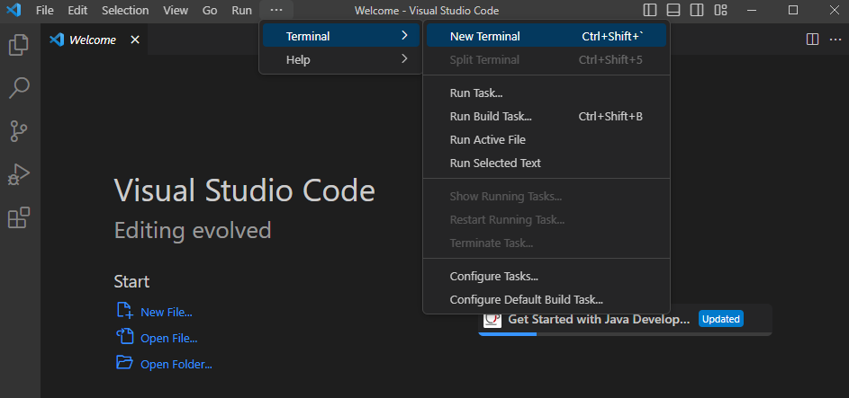
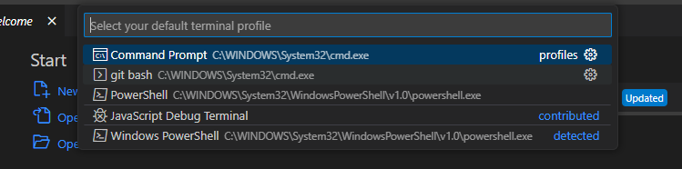
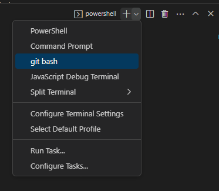

Lab Report 1

Installing VScode:
Because I already had VScode installed on my computer, I did not do the steps to install it. 

Remotely Connecting:
I downloaded git verson 2.40.0 by clicking the link provided in the lab instructions. Then I opened VScode and opened a new terminal. 

I typed ctr + shift + p and typed in Select Default Profile, then selected git bash from the options.

On the top right of the terminal, I clicked on the down arrow and selected git bash.

Next, I typed $ ssh cs15lwi23zz@ieng6.ucsd.edu into the terminal, where I was then prompted to enter my password. 

However, due to issues, I was unable to remotely connect during the lab.

Trying Some Commands:
I typed in some commands into the terminal, which were ls, cd ~, ls -lat

