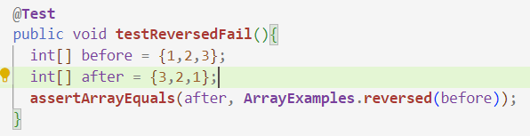
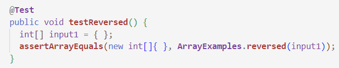
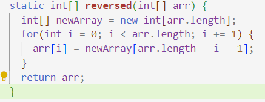
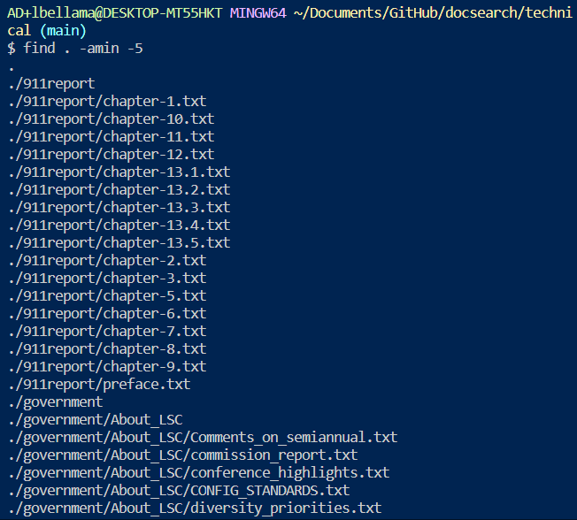
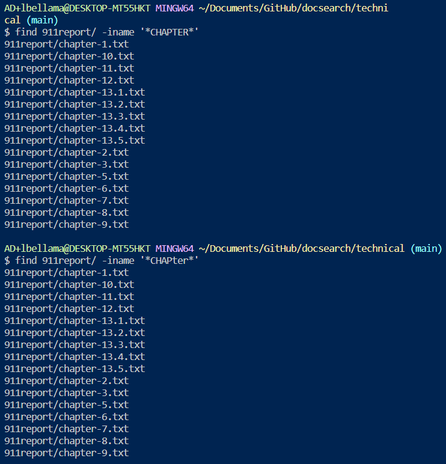

Lab Report 3

CSE 15L Software Tools and Techniques

Leila Bellama

11/05/23

Part 1 - Bugs:
A failure-inducing input for the buggy program, as a JUnit test and any associated code (write it as a code block in Markdown)

An input that doesn’t induce a failure, as a JUnit test and any associated code (write it as a code block in Markdown)

The symptom, as the output of running the tests (provide it as a screenshot of running JUnit with at least the two inputs above)

The bug, as the before-and-after code change required to fix it (as two code blocks in Markdown)
Briefly describe why the fix addresses the issue.

Before:

After:

The fix I made was changing the inside of the for loop so that the new array is the array being changed,to the reverse of the original, and then the new aarray gets returned instead of the original. 

Part 2 - Reasearching commmands:

  -size

In this example, I used the find - size command to find any files in the government/ directory that are less than 3 gigabytes.

This example uses the same command, but on the 911report/ directory. This option would be useful to find certain files that are under a certain size or to make sure that all your files are under a certain size.

  -amin 
  

An option that can be used with the find command is the -amin command. In this example I used it to access all the files in the current directory that had been accessed in the last 5 minutes. 

I used the -amin option with the -5 as the argument along with the find command in order to pull up all the files in the 911report/ directory that been accessed in less than 5 minutes ago. This would be useful if you are trying to locate a file that you had been recentely working on but don't know where it is. 

  -type

I used the find command with the -type option with the argument d, which will only output the directories in the current directory. When I tried it on the 911report/ the only result was 911report/ because that directory did not contain any directories. This would be useful in searching for a certain type of file, or only pulling up files of one type.  

  -iname
  

The -iname option operates similarly to the -name option except it is not case sensitive. I used it on the 911report/ directory, once with the term "CHAPTER" and once with "CHAPter" and they both came up with the same results. This allows for you to be less specific with the term that you are looking for, and you don't have to remember what letters are capatilized. 

Sources:

For all of the options in part two I utilizedd this website: https://www.computerhope.com/unix/ufind.htm#examples

