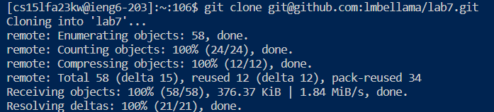

Lab Report 4

CSE 15L Software Tools and Techniques

Leila Bellama

11/18/23

Step 4: Logging into ieng6

Keys Pressed: `ssh cs15lfa23kw@ieng6.ucsd.edu`  `<enter>`

To log into ieng6, after I made sure that the terminal was using bash, I entered "ssh cs15lfa23kw@ieng6.ucsd.edu" into the terminal and hit "enter".

Step 5: Cloning the fork from Github

Keys Pressed: `git clone` `<space>`  `<Ctrl>` + `<v>` `<enter>`, `cd lab7` `<enter>`

After I had already copied the ssh URL from github,  I typed "git clone" and hit <Ctrl> + <v> in order to paste the URL into the terminal, then pressed <"enter">. I also had to change the working directory to the "lab7" directory by typing "cd lab7" and <"enter"> into the terminal.

Step 6: Running the tests

Keys Pressed: `<Ctrl>` + `<v>` `<space>` `ListExamplesTests.java` `<enter>`, `<Ctrl>` + `<v>` `<space>` `ListExamplesTests` `<enter>`

To compile and run the tests in ListExamplesTests.java I pasted "javac -cp .:lib/hamcrest-core-1.3.jar:lib/junit-4.13.2.jar" using "ctrl" + "v" into the terminal, hit "space", typed "ListExamplesTests.java", and hit "enter". I also pasted "java -cp .:lib/hamcrest-core-1.3.jar:lib/junit-4.13.2.jar org.junit.runner.JUnitCore" into the terminal using the same keys as before then pressed "space" and typed "ListExamplesTests" and hit <"enter">.

Step 7: Editing using vim

Keys Pressed: `vim List` `<tab>` `<.java>` `<enter>`, `<j>``<j>``<j>``<j>``<j>``<j>``<j>``<j>``<j>``<j>``<j>``<j>``<j>``<j>``<j>``<j>``<j>``<j>``<j>``<j>``<j>``<j>``<j>``<j>``<j>``<j>``<j>``<j>``<j>``<j>``<j>``<j>``<j>``<j>``<j>``<j>``<j>`, `<h>``<h>``<h>``<h>``<h>``<h>`, `<x>` `<i>` `<2>`  `<esc>` `<:wq>` `<enter>`

To edit the "ListExamples.java" file, I typed "vim List" into the terminal and hit the tab button to autofill the rest of the file name but I had to type the ".java" at the end before hitting "enter". I hit "j" 37 times to move down to the line I wanted to edit. To make the edit, I pressed "h" 6 times to move the curser over to the "1" in "index1", and pressed "x", then "i", then pressed "2", to delete the 1 and write the 2. Lastly, I saved and closed the file by pressing "esc" and typing ":wq" then "enter".

Step 8: Rerunning the tests

Keys Pressed: `<up>` `<up>` `<up>` `<enter>`, `<up>` `<up>` `<up>` `<enter>`, 

I reran the tests by pressing the "up" key 3 times then presing "enter" because the first line to complie and run the tests was 3 commands up in the history, then I pressed the "up" key another three times and hit "enter" to get the second line to compile and run the tests.

Step 9: Commit and push

Keys Pressed: `<git add>` `<space>` `<List>` `<tab>` `<.java>` `<enter>`, `<git commit -m "index1 -> index2">` `<enter>`

Finally, to commit and push to Github, I typed "git add List", then pressed tab to autofil the rest of the name, then ".java" and hit <"enter">. After that I typed "git commit -m 'index1 -> index2'" and hit <"enter">, and then "git push" and <"enter">.

Sources:

https://www.baeldung.com/linux/vim-search-replace

https://www.barbarianmeetscoding.com/boost-your-coding-fu-with-vscode-and-vim/inserting-text/
