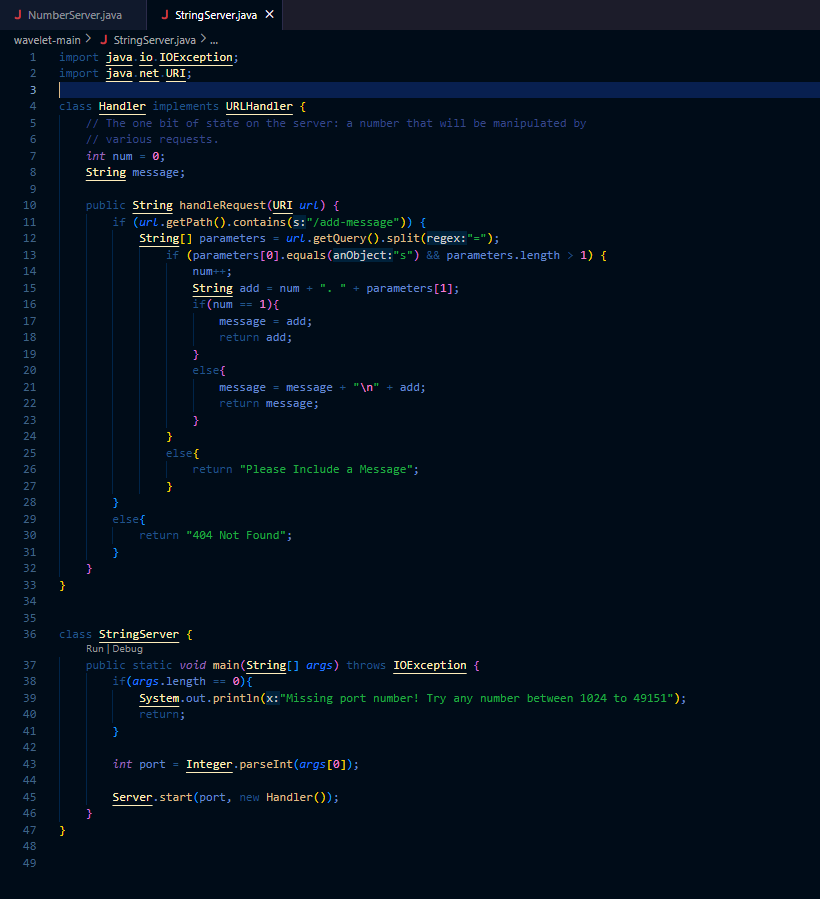

Lab Report 1
helloooo
Leila Bellama

10/09/2023

CSE 15L 

`cd` Command Examples:

Before I entered the `cd` command without an argument, the working directory was /home and afterwards it was still "/home". I got this output because I didn't enter a directory to change to, so it stayed the same. 
This is not an error because the directory should not have changed by using the `cd` command without an argument.

When I entered the `cd` command with the lecture1 directory as an argument, the working directory was the home directory. Afterwards the working directory was ~/lecture1 because the `cd` command changes the working directory, so entering lecture1 as an argument changed the working directory to that. This was not an error.

The working directory when I entered the `cd` command with the "fr.txt" as an argument was "~/lecture1/messages". The result was "bash: cd: fr.txt: Not a directory". This error was because the the text file was not a valid argument for this command because a file cannot be the working directory.

`ls` Command Examples:

When I entered the `ls` command without an argument, the working directory was the home directory and the output was "lecture1". This was the output because the `ls` command returns a list of the files in the directory. This output was not an error because the "lecture1" file was the only file in the working directory at the time.

When I used the directory "lecture1" as an argument for the `ls` command, with the home directory as the working directory, the output was "Hello.class Hello.java messages README", which is a list of the files in the "lecture1" directory. This was the output because the `ls` command returns a list of the files in something, and since I included an argument, it returned the list of files in the argument, which was the "lecture1" directory.

I entered the `ls` command with the fr.txt file as an argument when the working directory was "~/lecture1", and the output was "ls: cannot access 'fr.txt': No such file or directory". This was the output because from the ~lecture1 directory, it cannot access the fr.txt file becuse that file is in the "messages" directory in the "lecture1" directory. However, when I changed the direcctory to the "~lecture1/messages" and entered the `ls` command with the "fr.txt" file as an argument, the output was "fr.txt". This was because the `ls` command lists the contents of a path, and because the "fr.txt" file isn't directly in the "~lecture1" path, it was unable to access the contents of the path and list them.

`cat` Command Examples:

When I used the `cat` command without an argument, the directory was "~lecture1/messages". The result was that it started a new, blank line and when I typed in the word "cat" and hit enter, it returned the word "cat" and I repeated this again with the word "hello". To exit this, I used the ctrl + d command. 

Before I entered the `cat` command with the "lecture1" as an argument, the working directory was the home directory and the output was "cat: lecture1: Is a directory". This error occurred because the `cat` command returns the contents of a file, so a directory cannot be used as an argument. I even checked what would happen if I changed the current directory to "~lecture1" and then entered the `cat` command with "lecture1" as an argument. The result of this was "cat:lecture1: No such file or directory". I also repeated that process with the "messages" directory and got the same result. 

When I entered the `cat` command with the text file "fr.txt", the working directory was "~lecture1/messages". The result was the text "Bonjour le monde". This result was not an error because that phrase was the only contents of the "fr.txt" file.

Lab Report 2

CSE 15L Software Tools and Techniques

Leila Bellama

10/23/23

Part 1:

String Server Code:

Example 1:

The methods that are called are the main method in the StringServer class, which calls the handleRequest() method. The handleRequest() method has an argument for a URI and has two fields, int num which is 0 and a string called message that is null. Both of the values in those two feilds change when this request is made. The num integer gets incremented by one and the message is changed to include the new line.

Example 2:

The methods that were called were the same as before, the main method from the StringServer class and the handleRequest() method in the Handler class. The arguments in the main method are the commands from the command line. And the arguments for the handleRequest() method is a URI. The feilds for the handleRequest() method are an integer called n and a string called message. Initially, n is equal to 1 and message is "1. hi", and after the command n equals 2 and message is "1. hi" + "/n" +  "2.how was your day?". 

Part 2:

Path to private key:

Path to public key:

Logging on without a password:

Part 3:

Something that I learned about this week that I didn't know about before are port numbers. Servers can have multiple ports and port numbers are used to identify different ports. There are two ports, 80 and 443, that are commonly used on the web.

