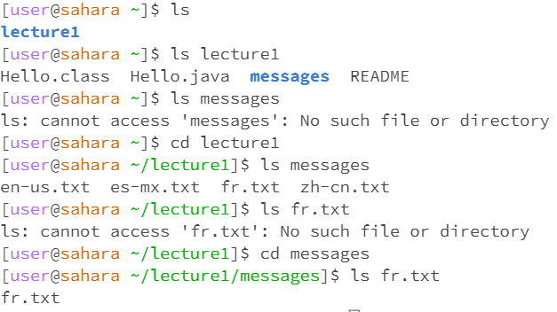

Lab Report 1

Installing VScode:
Because I already had VScode installed on my computer, I did not do the steps to install it. 

Remotely Connecting:
I downloaded git verson 2.40.0 by clicking the link provided in the lab instructions. Then I opened VScode and opened a new terminal. 

I typed ctr + shift + p and typed in Select Default Profile, then selected git bash from the options.

On the top right of the terminal, I clicked on the down arrow and selected git bash.

Next, I typed $ ssh cs15lwi23zz@ieng6.ucsd.edu into the terminal, where I was then prompted to enter my password. 

However, due to issues, I was unable to remotely connect during the lab.

Trying Some Commands:

I typed in some commands into the terminal, which were ls, cd ~, ls -lat

10/3/23

Example with no arguments:

Example with a path to a directory as an argument:

Example with a path to a file as an argument:

Lab Report 1

Leila Bellama

10/09/2023

CSE 15L 

`cd` Command Examples:

Before I entered the `cd` command without an argument, the working directory was /home and afterwards it was still "/home". I got this output because I didn't enter a directory to change to, so it stayed the same. 
This is not an error because the directory should not have changed by using the `cd` command without an argument.

When I entered the `cd` command with the lecture1 directory as an argument, the working directory was the home directory. Afterwards the working directory was ~/lecture1 because the `cd` command changes the working directory, so entering lecture1 as an argument changed the working directory to that. This was not an error.

The working directory when I entered the `cd` command with the "fr.txt" as an argument was "~/lecture1/messages". The result was "bash: cd: fr.txt: Not a directory". This error was because the the text file was not a valid argument for this command because a file cannot be the working directory.

`ls` Command Examples:

When I entered the `ls` command without an argument, the working directory was the home directory and the output was "lecture1". This was the output because the `ls` command returns a list of the files in the directory. This output was not an error because the "lecture1" file was the only file in the working directory at the time.

When I used the directory "lecture1" as an argument for the `ls` command, with the home directory as the working directory, the output was "Hello.class Hello.java messages README", which is a list of the files in the "lecture1" directory. This was the output because the `ls` command returns a list of the files in something, and since I included an argument, it returned the list of files in the argument, which was the "lecture1" directory.

I entered the `ls` command with the fr.txt file as an argument when the working directory was "~/lecture1", and the output was "ls: cannot access 'fr.txt': No such file or directory". This was the output because from the ~lecture1 directory, it cannot access the fr.txt file becuse that file is in the "messages" directory in the "lecture1" directory. However, when I changed the direcctory to the "~lecture1/messages" and entered the `ls` command with the "fr.txt" file as an argument, the output was "fr.txt". This was because the `ls` command lists the contents of a path, and because the "fr.txt" file isn't directly in the "~lecture1" path, it was unable to access the contents of the path and list them.

`cat` Command Examples:

When I used the `cat` command without an argument, the directory was "~lecture1/messages". The result was that it started a new, blank line and when I typed in the word "cat" and hit enter, it returned the word "cat" and I repeated this again with the word "hello". To exit this, I used the ctrl + d command. 

Before I entered the `cat` command with the "lecture1" as an argument, the working directory was the home directory and the output was "cat: lecture1: Is a directory". This error occurred because the `cat` command returns the contents of a file, so a directory cannot be used as an argument. I even checked what would happen if I changed the current directory to "~lecture1" and then entered the `cat` command with "lecture1" as an argument. The result of this was "cat:lecture1: No such file or directory". I also repeated that process with the "messages" directory and got the same result. 

When I entered the `cat` command with the text file "fr.txt", the working directory was "~lecture1/messages". The result was the text "Bonjour le monde". This result was not an error because that phrase was the only contents of the "fr.txt" file.

