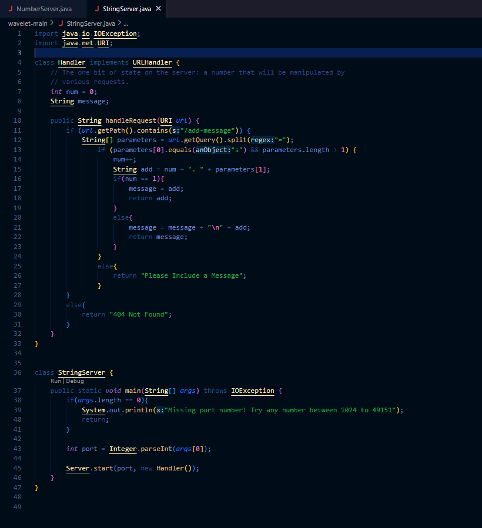
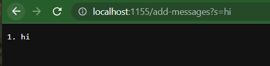
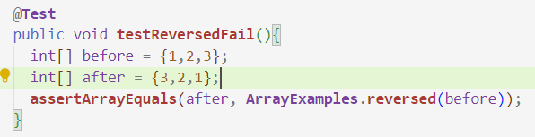
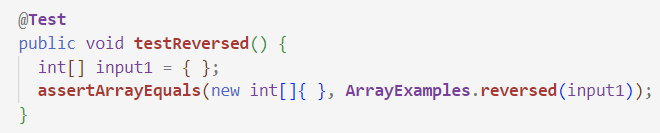
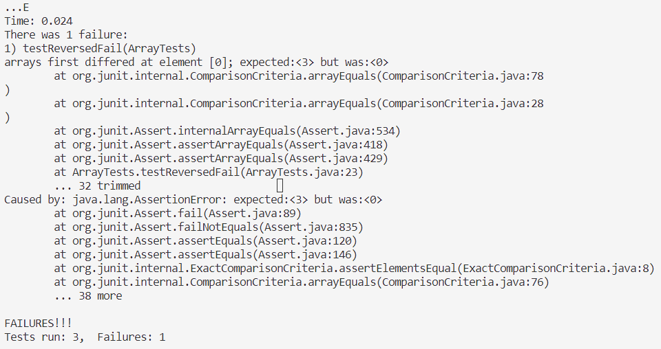
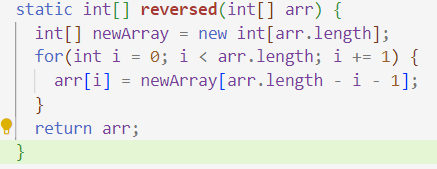
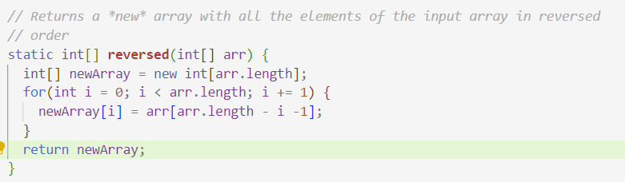

Lab Report 2

CSE 15L Software Tools and Techniques

Leila Bellama

10/23/23

Part 1:

String Server Code:

Example 1:

Part 1 - Bugs:
A failure-inducing input for the buggy program, as a JUnit test and any associated code (write it as a code block in Markdown)

An input that doesn’t induce a failure, as a JUnit test and any associated code (write it as a code block in Markdown)

The symptom, as the output of running the tests (provide it as a screenshot of running JUnit with at least the two inputs above)

The bug, as the before-and-after code change required to fix it (as two code blocks in Markdown)
Briefly describe why the fix addresses the issue.

Before:

After:

The fix I made was changing the inside of the for loop so that the new array is the array being changed ,to the reverse of the original, and then the new aarray gets returned instead of the original. 
