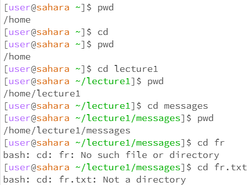

cd command:

Before I entered the cd command without an argument, the working directory was /home and afterwards it was still /home.
I got this output because I didn't enter a directory to change to, so it stayed the same. 
This is not an error because the directory should not have changed by using the cd command without an argument.

When I entered the ls command without an argument, the working directory was the home directory and the output was "lecture1". This was the output because 
