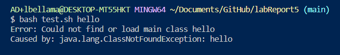

Part 1 - Debugging Scenario

1-The original post from a student with a screenshot showing a symptom and a description of a guess at the bug/some sense of what the failure-inducing input is. (Don’t actually make the post! Just write the content that would go in such a post)

2-A response from a TA asking a leading question or suggesting a command to try (To be clear, you are mimicking a TA here.)

3-Another screenshot/terminal output showing what information the student got from trying that, and a clear description of what the bug is.

4-At the end, all the information needed about the setup including:
-The file & directory structure needed
-The contents of each file before fixing the bug
-The full command line (or lines) you ran to trigger the bug
-A description of what to edit to fix the bug
You should actually set up and run the scenario from your screenshots. It should involve at least a Java file and a bash script. Describing the bug should involve reading some output at the terminal resulting from running one or more commands. Design an error that produces more interesting output than a single message about a syntax or unbound identifier error – showcase some interesting wrong behavior! Feel free to set this up by cloning and breaking some existing code like the grading script or code from class, or by designing something of your own from scratch, etc.

1)Student's post:

The screenshot below of the terminal output shows the symptom of a bug. I entered the command `bash test.sh` with the argument `hello`, which should have ran the bash script file test.sh that compiles and runs the palindromeChecker.java file with the command line argument as the argument. The terminal error says "Could not find or load main class hello", which 

