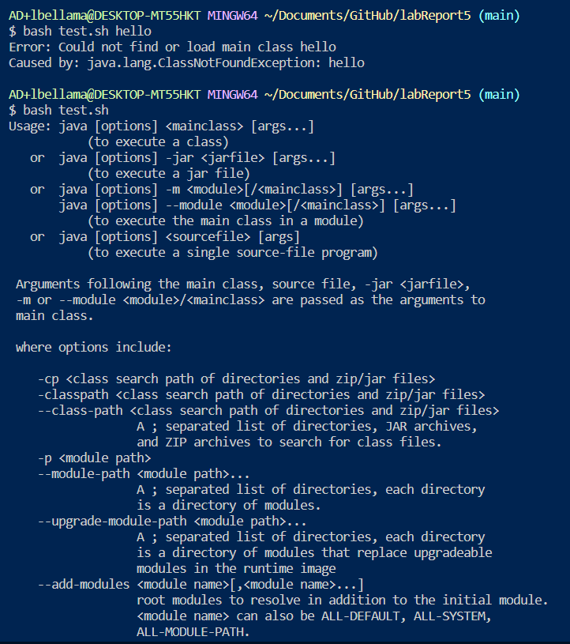

Part 1 - Debugging Scenario

1)Student's post:

The symptom below was a result of trying to run a bash file with the argument "hello". The bash file is supposed to compile and run another file, palindromeChecker.java, with the command line argument as the argument. Maybe the bug is a complication with compiling the file that the bash file is supposed to run.

2)TA's Response:

Well you could try compiling and running your palindromeChecker.java file from the command line to see if it will cause an error. If there is no error, then the bug could be a problem with calling the file in your bash file.

3)Student's Response:

What I learned from entering the command `javac *.java`, was that the .java files in the current directory can be compiled without an issue. The bug isn't in the palindromeChecker.file because I was able to call it the the argument "hello" and got the correct output. And I learned that the bug is in the line of code in the bash file that calls palindromeChecker.java, which is the line `java -cp palindromeChecker $@` because when I entered that line in the terminal with and without an argument, there were errors. When I entered that line with the same argument as before, "hello", it produced the same error message as before. The terminal output when I tried the line without an argument was a list of the ways `java` command can be used as well as the options compatable with it. This tells me that that line in the bash script incorrectly uses the `java` command.

The bug that was causing the errors was the `-cp` option that I had in the third line of the test.sh file where I called the palindromChecker class after compling all the .java files in the directory. This was causing issues because using the `-cp` option with the `java` command without entering a classpath causes an error. 

4)Setup Information:

-file and directory structure:

The only files I needed were the files palindromeChecker.java and test.sh, which were both in my labReport5 directory.

-contents of files before fixing the bug 

test.sh:

palindromeChecker.java:

-contents of files after fixing the bug

test.sh:

palindromeChecker.java:

-command line/s that triggered the bug

The failure-inducing inputs that caused this symptom were the terminal commands `bash test.sh hello` and `bash tesh.sh`  

-description of edits

The edit that was made to fix the bug was deleting the `-cp` from the third line of the test.sh file. 
