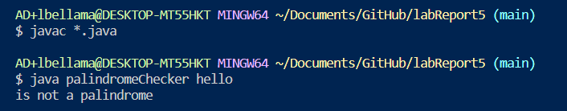

Part 1 - Debugging Scenario

1-The original post from a student with a screenshot showing a symptom and a description of a guess at the bug/some sense of what the failure-inducing input is. (Don’t actually make the post! Just write the content that would go in such a post)

2-A response from a TA asking a leading question or suggesting a command to try (To be clear, you are mimicking a TA here.)

3-Another screenshot/terminal output showing what information the student got from trying that, and a clear description of what the bug is.

4-At the end, all the information needed about the setup including:
-The file & directory structure needed
-The contents of each file before fixing the bug
-The full command line (or lines) you ran to trigger the bug
-A description of what to edit to fix the bug
You should actually set up and run the scenario from your screenshots. It should involve at least a Java file and a bash script. Describing the bug should involve reading some output at the terminal resulting from running one or more commands. Design an error that produces more interesting output than a single message about a syntax or unbound identifier error – showcase some interesting wrong behavior! Feel free to set this up by cloning and breaking some existing code like the grading script or code from class, or by designing something of your own from scratch, etc.

1)Student's post:

The screenshot below of the terminal output shows the symptom of a bug. The failure-inducing inputs that caused this symptom were the terminal commands `bash test.sh hello` and `bash tesh.sh`.  
When I entered the command `bash test.sh` with the argument `hello`, it should have ran the bash script file test.sh that compiles and runs the palindromeChecker.java file with the command line argument as the argument. However, the output was "Error: Could not find or load main class hello".
And the second attempt where I entered the command `bash test.sh` without an argument, the terminal output jave me the list of options that can be used with the `java` command.

2)TA's Response:

Well you could try compiling and running your file with your code, the palindromeChecker.java file, from the command line with the same arguments to see if your code works as expected. If it does, then the issue is with your compiling and calling the method, which would be your test.sh file. 

3)Student's Response:

What I learned from entering the command `javac *.java`, was that the .java files in the current directory can be compiled without an issue. And I learned that the code in the palindromeChecker.java file works as expected, because when I used the command `java palindromeChecker hello` the output was correct. This means that the bug is in the test.sh file. 
The bug that was causing the errors was the `-cp` that I had in the third line of the test.sh file where I called the palindromChecker class after compling all the .java files in the directory. This was causing issues because using the `-cp` option with the `java` command without entering a classpath causes an error. 

4-At the end, all the information needed about the setup including:
-The file & directory structure needed
-The contents of each file before fixing the bug
-The full command line (or lines) you ran to trigger the bug
-A description of what to edit to fix the bug
You should actually set up and run the scenario from your screenshots. It should involve at least a Java file and a bash script. Describing the bug should involve reading some output at the terminal resulting from running one or more commands. Design an error that produces more interesting output than a single message about a syntax or unbound identifier error – showcase some interesting wrong behavior! Feel free to set this up by cloning and breaking some existing code like the grading script or code from class, or by designing something of your own from scratch, etc.

4)Setup Information:

-file and directory structure:

The only files I needed were the files palindromeChecker.java and test.sh, which were both in my labReport5 directory.

-contents of files before fixing
test.sh:

palindromeChecker.java:

-contents of files after fixing
test.sh:

palindromeChecker.java:

-command line/s that triggered the bug

-description of edits
